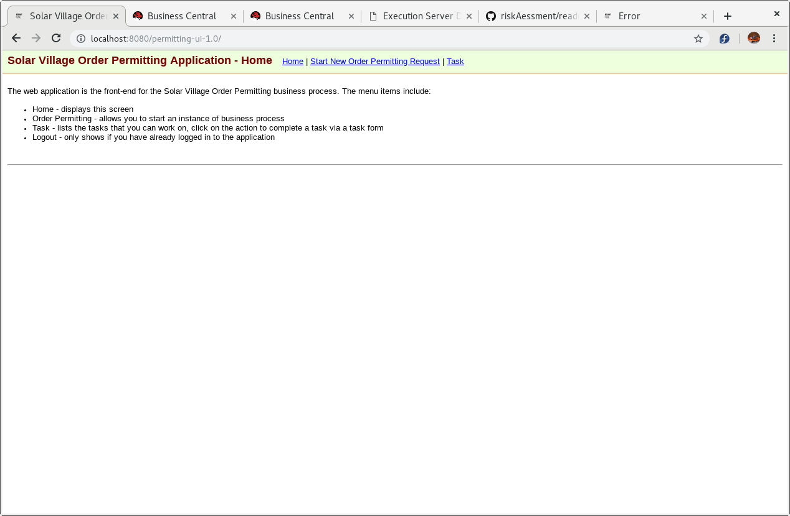
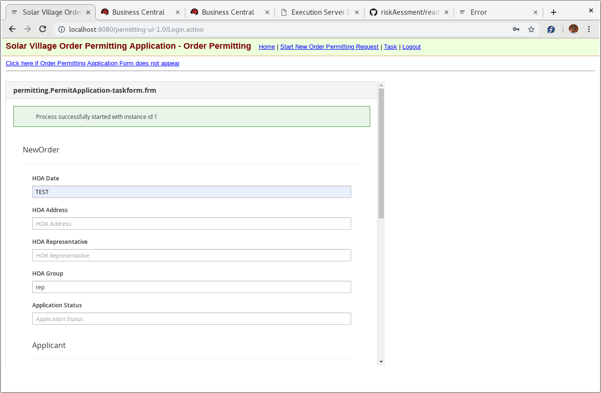
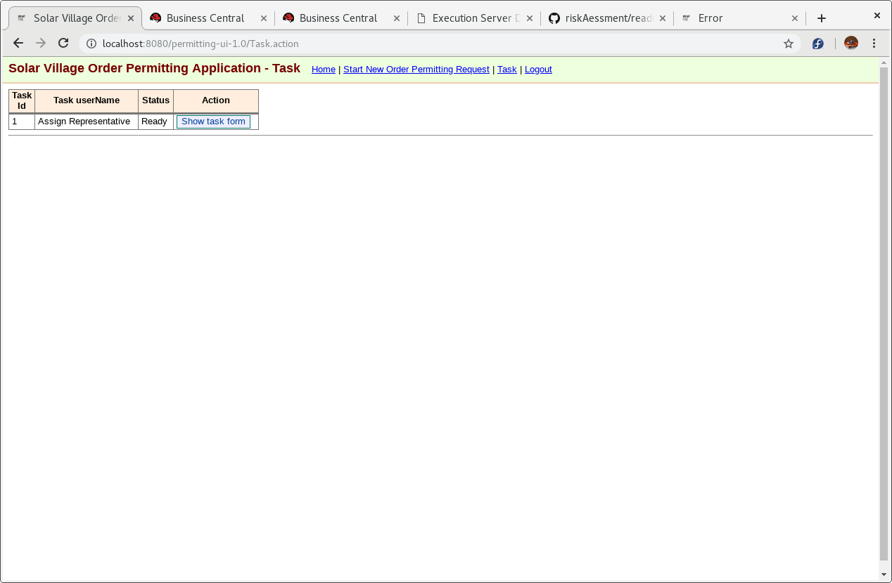
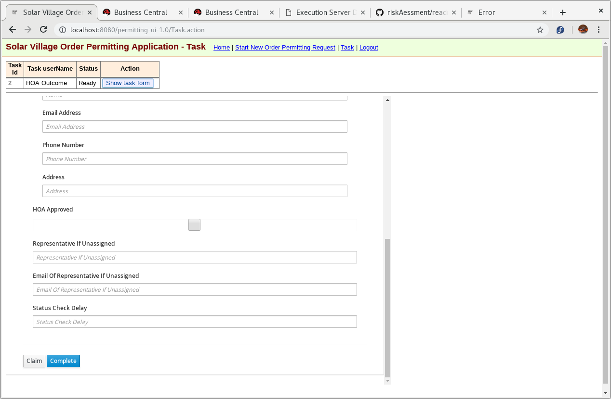

# 1. permitting-ui
This is the web-based user interface for the 'Order Permitting' business process
```
https://github.com/AndyYuen/permitting
```

#2 Build the web UI 
1. Create and change to the github repository
  ```
  $ mkdir ~/github
  $ cd ~/github
  ```
2. Execute the git clone command:  

  ```
  $ git clone https://github.com/AndyYuen/permitting-ui.git
  ```
3. Build the services by executing 
  ```
  $ cd ~/github/permitting-ui
  $ mvn clean package
  ```Install the web UI onto EAP

Use the file manager to copy the file: 
```
~/github/permitting-ui/target/permitting-ui-1.0.war
``` 
to the 
```
jboss-eap-7.2/standalone/deployment
```
directory. On successful installation, you will see the file: 
```
permitting-ui-1.0.war.deployed
```
 in the jboss-eap-7.2/standalone/deployment directory
```

## 3. Run the UI.

The UI has been developed to allow the creation of new process instances and retrieve/action tasks.
Here is a pictorial introduction to the web UI.
Web UI Home


Start Process


Show Task List


Show Task Form to Action


The parmeters in the forms are described below:

| Parameter | Mandatary | Description |
| --- | --- |
| HOA Date | Yes | The date for HOA in format 2019-05-30T12:30:00. The check for whether a representative has been assigned is set at 1 day before the HOA Date. if TEST is specified, the check will be set at 45 seconds from now. |
| HOA Address | No | Address at which the HOA is to be held. |
| HOA Representative | No | This will be set within the business process. |
| HOA Group | No | the group for the users of this application. Default is "rep". |
| Application Status | NO | Unused. |
| Applicant Name | Yes | Name of applicant. |
| Applicant Email Address | No | Email address of applicant. |
| Applicant Phone Number | No | Phone number of applicant. |
| Applicant Address | No | Address of applicant. |
| HOA Approved | No | This will be set within the business process. |
| Representative If Unassigned | No | Default is "representative". |
| Email of Representative If Unassigned | Yes | Email of nominated representative. Otherwise, the email will be sent to me. |
| Status Check Delay | No | Time between each getPermitRequestStatus check. | 


